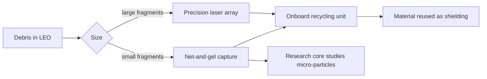

# 🛸 S.O.S — Sustainable Orbit Sweeper

> 🥉 3rd Place — NASA Space Apps Challenge 2025
> Team Orion · Orbital Debris Mitigation Mission

## The Problem

Low Earth Orbit is becoming critically congested with millions of debris fragments threatening active satellites, human missions, and future space development.

## Our Solution

A modular satellite designed to actively collect, process, and recycle orbital debris in LEO using two capture systems working together.

## How It Works

## Capture Mechanisms

| Mechanism | Target |
|---|---|
| Net-and-gel system | Small debris fragments |
| Precision laser array | Large fragments |
| Research core | Studies micro-particles |
| Recycling unit | Repurposes material as shielding |

## Vision 2040

| Phase | Units | Coverage |
|---|---|---|
| Now | 1 prototype | Single LEO orbit |
| 2030 | 10 units | Multiple LEO regions |
| 2040 | 50 units | Full LEO coverage |

## Status and Limits

- **Concept phase:** this is a mission concept from a hackathon challenge. No hardware has been built or tested in orbit.
- **Open engineering questions:** capture reliability, laser safety and power budget, cost per unit, and the rules for handling debris that belongs to other countries all need proper studies before the 2030 and 2040 targets mean anything.
- **What the team delivered:** the mission architecture, concept documentation and a presentation that placed 3rd at NASA Space Apps Challenge 2025.

## My Role

Mission architecture design, concept documentation, and presentation lead for Team Orion at NASA Space Apps Challenge 2025.

## Recognition

- 3rd Place — NASA Space Apps Challenge 2025
- Invited Participant — World Space Week 2025, JUST

